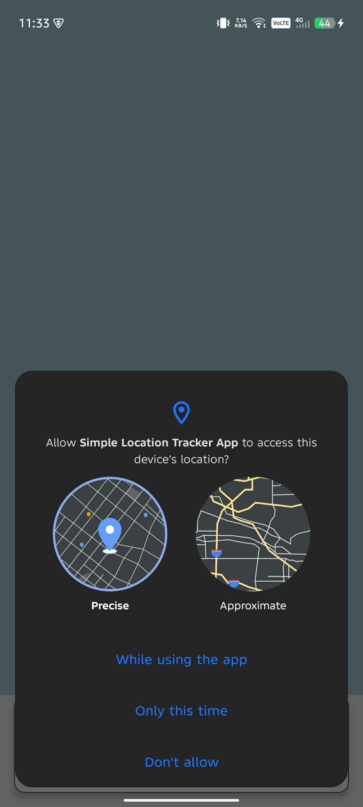
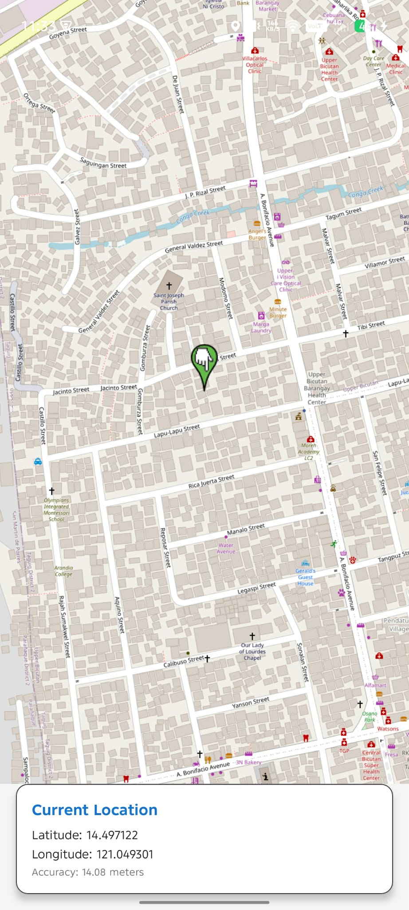

# Simple Location Tracker App

A basic Android app that displays your current location on a map using GPS and OpenStreetMap (OSMDroid). The app updates your position in real time and shows your coordinates and GPS accuracy.

---

## App Description

This app tracks your location and displays it on an interactive OpenStreetMap. As you move, the marker updates to show your current position. The app also shows your latitude, longitude, and the accuracy of the GPS reading.

---

## Permissions Used

The app requires the following permissions:

- **ACCESS_FINE_LOCATION**: Accesses your precise location using GPS satellites.
- **ACCESS_COARSE_LOCATION**: Accesses your approximate location using WiFi or cell towers.
- **INTERNET**: Downloads map tiles from OpenStreetMap servers.
- **ACCESS_NETWORK_STATE**: Checks if you are connected to the internet to download maps.
- **WRITE_EXTERNAL_STORAGE**: Caches map tiles for faster loading (required only on older Android versions).

When you first open the app, Android will prompt you to allow location access. You must grant permission for the app to function.

---

## How GPS Location is Obtained

The app uses Google’s **FusedLocationProviderClient** to obtain your location. This service combines data from GPS, WiFi, and cell towers to provide the most accurate location possible. The app:

1. Requests high-accuracy location updates every 5 seconds.
2. Listens for location changes using a callback.
3. Updates the map marker and coordinate display whenever your location changes.

The map is displayed using the **OSMDroid** library, which requires no API key and is free to use. The map view is interactive, supports zooming and panning, and updates in real time as your location changes.

---

## Screenshots

Below are screenshots of the app in action:

**1. permission_request.png**


**2. map_location.png**


**3. location_update.png**


---

## Dependencies

```kotlin
implementation("com.google.android.gms:play-services-location:21.0.1")
implementation("org.osmdroid:osmdroid-android:6.1.18")
```

- Google Play Services for location tracking
- OSMDroid for map display (no API key required)

---

## Why OpenStreetMap?

- **No API key needed** – works out of the box
- **Completely free** – no billing or quotas
- **Open source** – community-driven map data
- **Simple setup** – just add the dependency and go

---

## Summary

This app demonstrates how to use GPS and runtime permissions in Android, and how to display real-time location on a map using OpenStreetMap. The setup is simple, privacy-friendly, and requires no API keys or billing setup.
